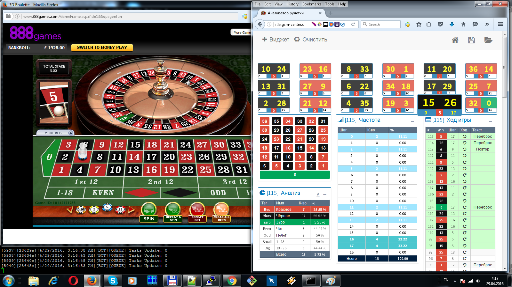

# Roulette Predictor #

[](https://github.com/conventional-changelog/standard-version)
[](https://github.com/tbaltrushaitis/roulette-predictor/blob/master/LICENSE)



:game_die: Casino Roulette :slot_machine: Analyzer and Predictor :coin:

`online` `casino` `roulette` `predictor` `real-time`

---

## :moneybag: Live Demo ##

Try now [Online Casino Roulette Analyzer and Predictor](http://bit.ly/roulette-predictor) :point_left:

---

## Setup ##

### Download ###

```shell
$ APP_NAME=roulette-predictor \
&& git clone https://github.com/tbaltrushaitis/${APP_NAME}.git \
&& cd ${APP_NAME} ;
```

### Install dependencies and build ###

```shell
$ make
```

---

### :link: More Info ###

 - [GitHub / Basic writing and formatting syntax](https://help.github.com/articles/basic-writing-and-formatting-syntax/)
 - [BitBucket Markdown Howto](https://bitbucket.org/tutorials/markdowndemo)
 - [Creating an Automated Build](https://docs.docker.com/docker-hub/builds/)

---

> :calendar: Developed in **March 2016**

:scorpion:
